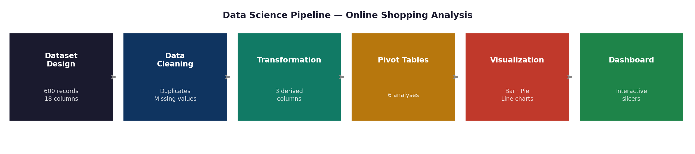
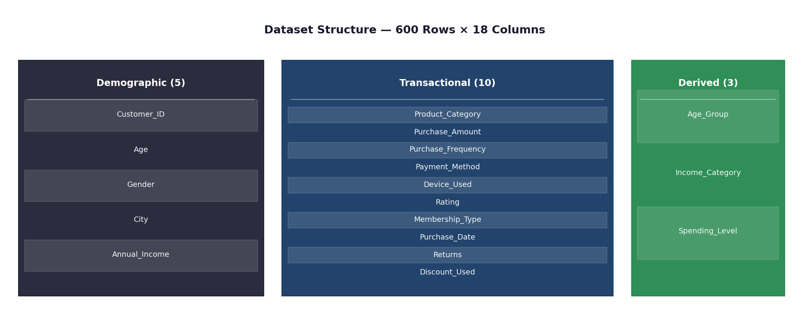
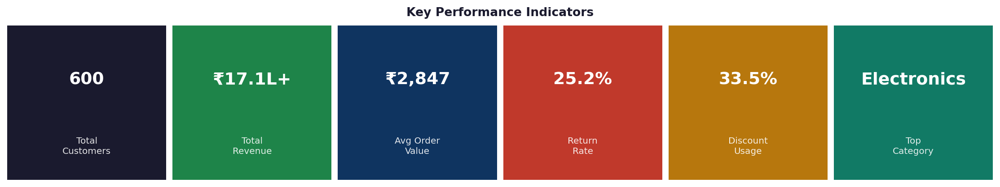
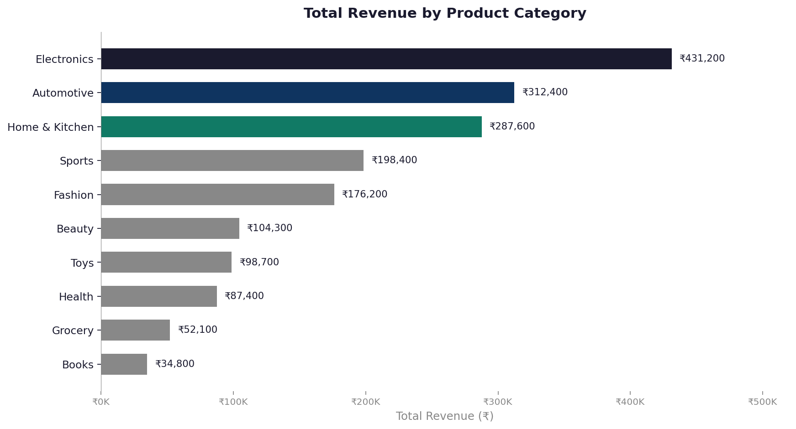
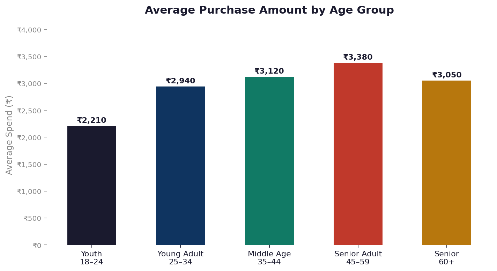
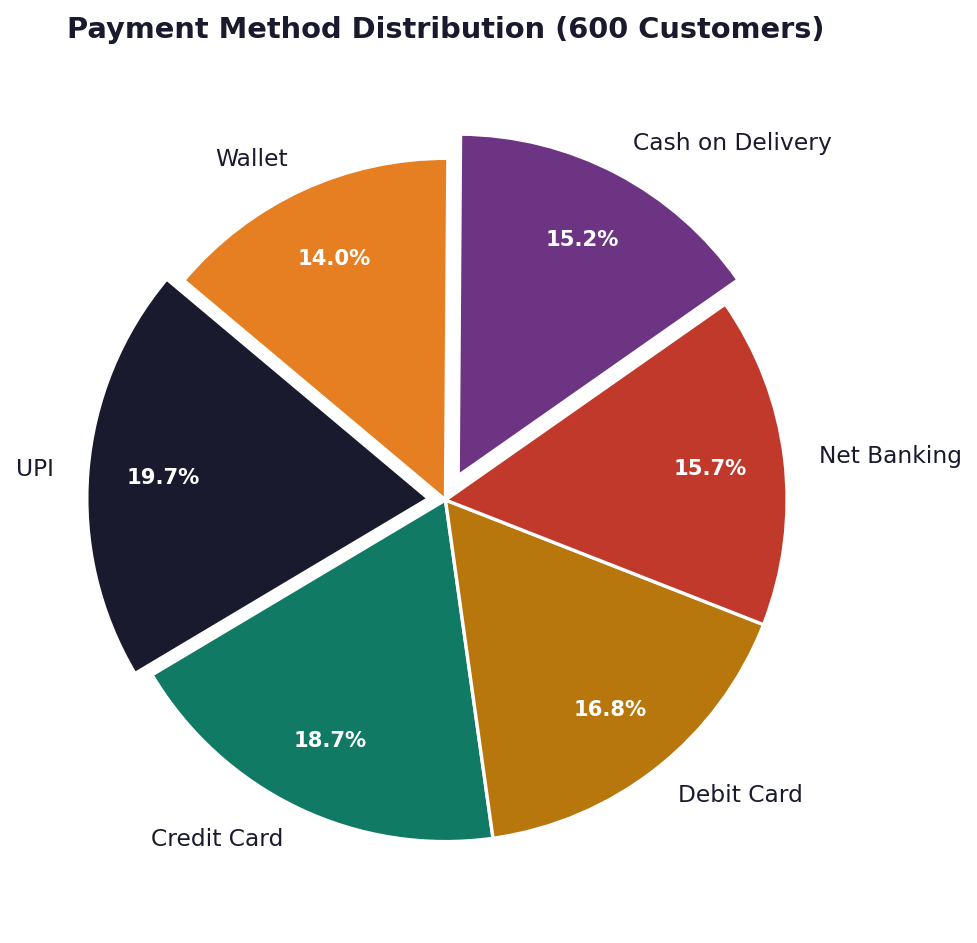
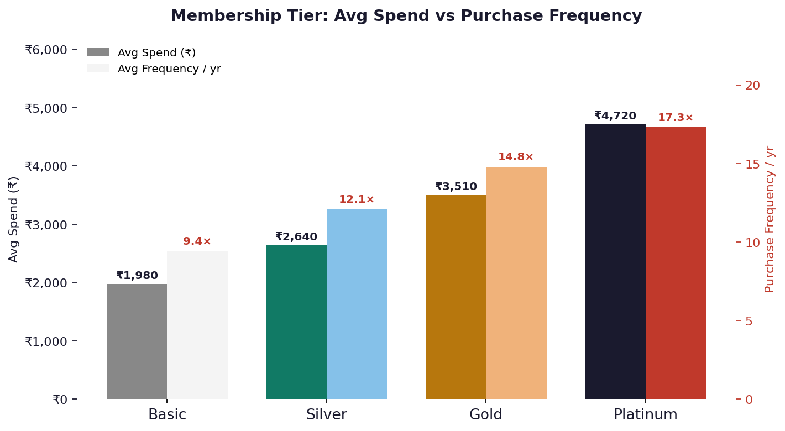

# Online Shopping Customer Behavior Analysis

**Course:** Data Science using Excel  
**Student:** Savio Tito
**Guide:** Parwan Singh  
**University:** Chandigarh University  
**Academic Year:** 2024–25  

---

## Overview

This project presents a complete data science workflow applied to online shopping customer behavior, built entirely inside Microsoft Excel. No programming language or external analytics platform was used. The goal was to demonstrate that Excel alone, when used rigorously, can support every stage of a data science pipeline — from raw data design and cleaning through transformation, analysis, visualization, and the construction of an interactive business dashboard.

The dataset was designed to reflect realistic Indian e-commerce purchasing patterns, calibrated against published benchmarks from NASSCOM and the Reserve Bank of India. It contains 600 customer records across 18 attributes covering demographics, transactional behavior, and three engineered segmentation columns.

---

## Project Pipeline



The project follows the CRISP-DM framework adapted for Excel. Each stage feeds directly into the next — clean data enables accurate transformation, transformed data enables meaningful pivot analyses, and those analyses populate the interactive dashboard.

---

## Repository Contents

```
online-shopping-analysis/
├── OnlineShopping_CustomerBehavior_Analysis.xlsx   # Full Excel workbook (7 sheets)
├── OnlineShopping_Presentation_v3.pptx             # Final presentation (15 slides)
├── images/                                         # Charts and visuals used in this README
│   ├── pipeline.png
│   ├── kpis.png
│   ├── dataset_structure.png
│   ├── category_revenue.png
│   ├── age_spend.png
│   ├── payment_pie.png
│   └── membership.png
└── README.md
```

The Excel workbook is organized into seven sheets:

| Sheet | Purpose |
|---|---|
| Dashboard | Interactive KPI cards, charts, and slicer filters |
| Raw Data | All 600 customer records across 18 columns |
| Data Cleaning Guide | Step-by-step cleaning instructions with Excel procedures |
| Formula Reference | All formulas used, documented with purpose and examples |
| Pivot Analysis | Six summary analyses across different dimensions |
| Charts | Bar, Pie, and Line charts with their source data tables |
| Academic Report | Full structured report embedded in the workbook |

---

## Dataset



The dataset contains 600 rows and 18 columns across three categories:

**Demographic attributes** capture who the customer is — their age (18 to 70), gender, city (10 major Indian cities), and annual income (INR 1.5L to 25L).

**Transactional attributes** capture what they did — which of 10 product categories they bought from, how much they spent, how often they buy per year, which of 6 payment methods they used, which device they shopped on, their satisfaction rating, their membership tier, the date of purchase, and whether they returned the product or applied a discount.

**Derived attributes** are three engineered columns created using nested IF formulas: Age_Group (five life-stage brackets), Income_Category (five socioeconomic tiers), and Spending_Level (Low / Medium / High / Premium based on purchase amount). These columns are what make the pivot table segmentation analyses possible.

---

## Key Performance Indicators



Across all 600 customers, the dataset produced the following headline metrics:

- **Total Revenue:** INR 17.1L+ combined purchase value
- **Average Order Value:** INR 2,847 per transaction
- **Return Rate:** 25.2% — roughly one in four orders was returned
- **Discount Usage:** 33.5% — one in three orders used a discount
- **Average Purchase Frequency:** 12.8 purchases per customer per year
- **Top Category by Revenue:** Electronics
- **Top Payment Method by Adoption:** UPI

---

## Results and Analysis

### Revenue by Product Category



Electronics leads all product categories in total revenue by a significant margin, generating INR 4,31,200 despite having fewer orders than Fashion. The reason is its high average order value of INR 6,073 — more than three times the average for Fashion. Automotive and Home & Kitchen round out the top three. Grocery and Books sit at the bottom of the revenue chart, reflecting their low per-unit prices rather than low demand.

### Spending Behavior Across Age Groups



Senior Adults (45–59) spend the most per transaction on average. However, Young Adults (25–34) represent the highest-value segment overall because they combine solid per-order spend with the highest purchase frequency of any group — 14.2 purchases per year. This gives them the greatest lifetime revenue contribution.

### Payment Method Distribution and Return Rates



UPI leads adoption at 19.7% of customers, followed closely by Credit Card. The most significant finding in this analysis is the behavior gap around Cash on Delivery: COD customers have the highest return rate (31.9%) and the lowest average spend (INR 2,210) of any payment method. By contrast, UPI and Credit Card customers return only around 23% of orders. This suggests that customers who commit to paying upfront are more deliberate buyers.

### Membership Tier Impact



Membership tier is the strongest controllable predictor of revenue per customer. Platinum members spend 2.4 times more per order and purchase 1.8 times more frequently than Basic members. Both metrics — spend and frequency — grow together as customers move up tiers, which means investing in loyalty program upgrades produces compounding returns.

---

## Data Cleaning Methodology

Four cleaning steps were applied to the raw dataset before any analysis:

1. **Duplicate removal** using the Data tab's Remove Duplicates function, keyed on Customer_ID. Zero duplicates were found.
2. **Missing value detection** using `COUNTBLANK()`. Numeric blanks were filled with the column mean using `AVERAGE()`; text blanks were replaced with "Unknown" via Find & Replace.
3. **Format standardization** — dates converted to DD-MMM-YYYY, currency columns formatted with thousand separators, all text columns cleaned with `=PROPER(TRIM())`.
4. **Data validation rules** applied to prevent future entry errors: Gender restricted to a dropdown list, Rating limited to whole numbers 1–5, Purchase_Amount required to be a positive decimal.

---

## Feature Engineering

Three columns were created from existing raw data using nested IF formulas:

**Age_Group** classifies each customer into one of five brackets: Youth (18–24), Young Adult (25–34), Middle Age (35–44), Senior Adult (45–59), and Senior (60+). This turns a continuous age value into a meaningful label for pivot table grouping.

```excel
=IF(B2<25,"Youth (18-24)",IF(B2<35,"Young Adult (25-34)",IF(B2<45,"Middle Age (35-44)",IF(B2<60,"Senior Adult (45-59)","Senior (60+)"))))
```

**Income_Category** groups annual income into five socioeconomic tiers from Low to High, using INR thresholds calibrated to the Indian income distribution.

```excel
=IF(E2<300000,"Low",IF(E2<600000,"Lower-Middle",IF(E2<900000,"Middle",IF(E2<1500000,"Upper-Middle","High"))))
```

**Spending_Level** classifies each transaction as Low (under INR 500), Medium (INR 500–2,000), High (INR 2,000–5,000), or Premium (above INR 5,000).

```excel
=IF(G2<500,"Low",IF(G2<2000,"Medium",IF(G2<5000,"High","Premium")))
```

---

## Pivot Table Analyses

Six pivot tables were built to answer specific business questions:

| Analysis | Row Field | Value Field | Question Answered |
|---|---|---|---|
| Income vs Purchase | Income_Category | Avg Purchase_Amount | Do richer customers spend more per order? |
| Age vs Frequency | Age_Group | Avg Purchase_Frequency | Which age group buys most often? |
| Category vs Revenue | Product_Category | Sum Purchase_Amount | Which category earns the most? |
| Payment vs Spending | Payment_Method | Avg Purchase_Amount | Does payment method affect spend? |
| Gender vs Behavior | Gender | Count, Sum, Avg | Do men and women shop differently? |
| Device vs Spending | Device_Used | Avg Purchase_Amount | Do desktop users spend more than mobile? |

---

## Interactive Dashboard

The dashboard consolidates all findings into a single Excel sheet with no macros. It is organized into three zones:

**Zone 1 — KPI Cards:** Six live formula-driven metric cards at the top of the sheet. Each references the Raw Data sheet directly and updates when the underlying data changes or when slicers are applied.

**Zone 2 — Charts and summary tables:** A bar chart showing revenue by category, a demographics table broken down by age group, and a line chart tracking average monthly spend across 2024. All visuals are connected to the pivot tables.

**Zone 3 — Interactive slicers:** Four slicers — Gender, City, Product_Category, and Membership_Type — are connected to all pivot tables via Report Connections. Clicking any slicer value filters every chart, table, and KPI card simultaneously.

---

## Key Findings

- Electronics generates the most revenue despite having fewer orders than Fashion, because each order is worth significantly more.
- Young Adults (25–34) produce the highest lifetime value by combining frequent purchasing with solid average spend.
- Cash on Delivery customers return orders at nearly twice the rate of UPI and Credit Card customers.
- Membership tier predicts spending more reliably than age, gender, or city. Upgrading a customer from Basic to Platinum more than doubles both their spend and frequency.
- Desktop users spend 28% more per transaction than mobile users, while mobile accounts for nearly 60% of total order volume.

---

## Business Recommendations

- Prioritize Electronics and Automotive categories with expanded SKU ranges and EMI financing options. These categories yield the highest return per order.
- Target Young Adults (25–34) with loyalty upgrade incentives — their high purchase frequency makes them the best candidates for Gold and Platinum tier conversions.
- Offer a prepaid payment incentive (such as a 5–10% discount) to reduce COD usage. Shifting COD customers to UPI could reduce the overall return rate by 7–10 percentage points.
- Serve high-value product categories on desktop and optimize mobile checkout for fast, low-friction purchases in Fashion and Grocery.

---

## Tools Used

| Tool | Purpose |
|---|---|
| Microsoft Excel 2019 / 365 | Entire pipeline — data, cleaning, analysis, visualization, dashboard |
| Excel PivotTables | Multi-dimensional aggregation and cross-tabulation |
| Excel Chart Wizard | Bar, Pie, and Line chart creation |
| Excel Slicers | Interactive dashboard filtering |
| Nested IF formulas | Feature engineering of derived columns |
| SUMIF / COUNTIFS / AVERAGEIFS | Conditional aggregation formulas |
| XLOOKUP / VLOOKUP | Cross-sheet data retrieval |

---

## Limitations

The dataset is synthetic. The patterns and findings are internally consistent and calibrated to real benchmarks, but they should be validated against actual transactional data before being used to drive business decisions. Excel's row limit of approximately one million rows and its lack of native machine learning support mean that predictive modeling and large-scale analysis would require migration to Python or a database-backed environment.

---

## Future Directions

The natural extensions of this project would include building a formal RFM scoring model to classify customers as Champions, Loyal, At-Risk, or Lost; training a churn prediction model in Python using scikit-learn; implementing collaborative filtering for product recommendations; and migrating the dashboard to Power BI for real-time refresh and cloud sharing. A generative AI integration could also be used to automatically produce plain-English narrative summaries from pivot table outputs.

---

## License

This project was created for academic purposes as part of the Data Science using Excel course at Chandigarh University. The dataset is fully synthetic and does not contain any real personal information.
# nline-shopping-customer-behavior-analysis
